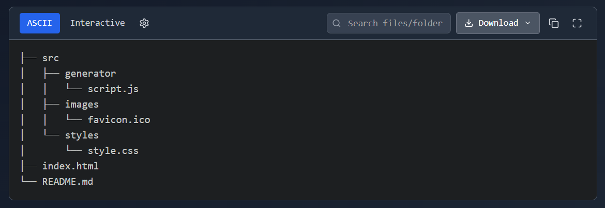
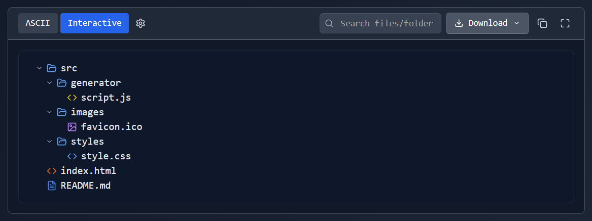
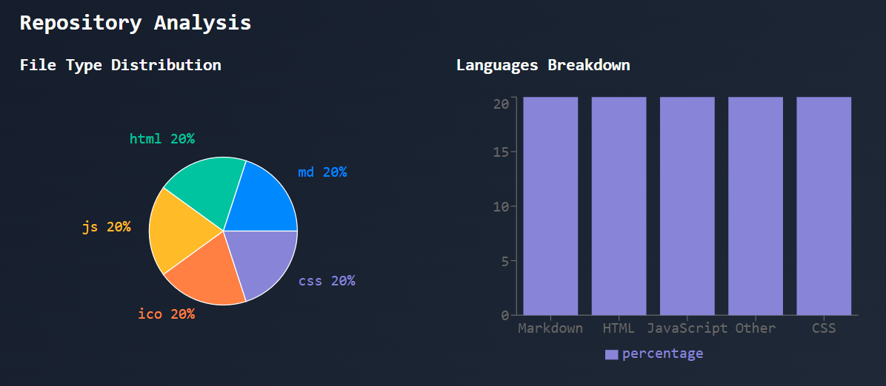

# RepoTree 🌳

A web tool that visualizes GitHub and GitLab repositories with clean ASCII trees. Perfect for documentation, sharing, and understanding project structures. It runs entirely in the browser and fetches live data using GitHub’s official [REST API (Git/Trees API)](https://docs.github.com/en/rest/git/trees?apiVersion=2022-11-28#get-a-tree) to ensure accuracy.

[](https://ascii-repotree.vercel.app/)
[](LICENSE)
[](https://github.com/coder-ralph/RepoTree)

## 🚀 Features

* 👀 **Instant Visualization**: Convert any GitHub & GitLab repository structure into a clean ASCII tree
* 🎯 **Interactive Tree View**: Expand or collapse folders for better navigation and exploration
* 📊 **Repository Analysis**: Visualize file type distribution and language breakdown with interactive graphs
* 💾 **Multiple Export Formats**: Download trees as README.md, .txt, .json, or .html files
* 🔍 **Real-time Search**: Quickly filter and highlight specific files or directories
* 🎨 **Dual View Modes**: Switch between ASCII and Interactive views for enhanced user experience
* 🌙 **Dark & Light Themes**: Comfortable viewing in any lighting condition
* ✨ **Syntax Highlighting**: Enhanced readability with beautiful code highlighting
* 📋 **One-Click Copy**: Copy directory structure to clipboard
* 💾 **Persistent State**: Remembers your last repository URL between sessions
* 🔒 **Private Repository Support**: Access private repos with personal access tokens
* 🚀 **Zero Installation**: Works directly in your browser - no setup required

## 🖥 Viewing Modes





## ⚙️ Tech Stack

RepoTree is built with modern technologies for optimal performance and user experience:

| Technology | Purpose | 
|------------|---------|
| **Next.js** | React framework for server-side rendering and routing |
| **TypeScript** | Type-safe development and better code quality |
| **Tailwind CSS** | Utility-first CSS framework for rapid UI development |
| **Shadcn UI** | Beautiful, accessible component library |
| **Octokit** | Official GitHub API client for repository data |
| **Recharts** | Composable charting library for data visualization |
| **Framer Motion** | Smooth animations and transitions |
| **Radix UI** | Low-level UI primitives for accessibility |
| **Lucide React** | Beautiful, customizable icon set |

## 🚦 Quick Start

### 1. **Online Usage** (Recommended)
Simply visit [RepoTree](https://ascii-repotree.vercel.app/) and start generating trees instantly!

### 2. **Self-hosting / Local Development**

```bash
# Clone the repository
git clone https://github.com/coder-ralph/RepoTree.git

# Navigate to project directory
cd RepoTree

# Install dependencies
npm install

# Start development server
npm run dev

# Open your browser
open http://localhost:3000
```

## 📖 Usage Guide

### Basic Usage
1. 🌐 Visit [RepoTree](https://ascii-repotree.vercel.app/)
2. 📝 Paste your GitHub or GitLab repository URL
3. 🔘 Click the **Generate** button
4. 🎉 Explore your repository structure!
5. 💾 Download in your preferred format

### 🔒 Accessing Private Repositories

For private repositories, you'll need to enable private access:

1. **Click "Enable Private Repos"** at the top of the input field
2. **Follow the setup instructions**:
   - **GitHub**: Create a personal access token with `repo` scope
   - **GitLab**: Create a token with `read_repository` scope
3. **Enter your token** - it's stored locally and never shared
4. **Generate trees** from your private repositories securely!

### 📊 Understanding Repository Analysis

RepoTree provides insightful visualizations:
- **File Type Distribution**: See what types of files make up your project
- **Language Breakdown**: Understand the programming languages used



## 🎯 Use Cases

- 📝 **Documentation**: Include clean directory trees in your README files
- 🎓 **Education**: Help students understand project structures
- 💼 **Code Reviews**: Quickly grasp repository organization
- 🔄 **Migration Planning**: Visualize before restructuring projects
- 📊 **Project Analysis**: Get insights into codebase composition

## 🤔 About

I created RepoTree to help developers easily visualize and share repository structures.

A year ago, I saw a Stack Overflow question about generating directory trees from GitHub repositories, which inspired me to build this tool.

**[Original Stack Overflow Question](https://stackoverflow.com/questions/75522166/how-do-i-get-the-directory-tree-structure-from-a-github-repository-link)** 📚

## 🤝 Contributing

Contributions are welcome! Report issues [here](https://github.com/coder-ralph/RepoTree/issues) or submit a Pull Request [here](https://github.com/coder-ralph/RepoTree/pulls).

## ⭐ Support

If RepoTree has helped you, please consider:
- ⭐ **Starring this repository** to show your support
- 💛 **Sharing it** with other developers

---

<div align="center">

Made with ☕ by [Ralph Rosael](https://app.daily.dev/coderralph)

</div>
